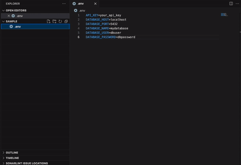
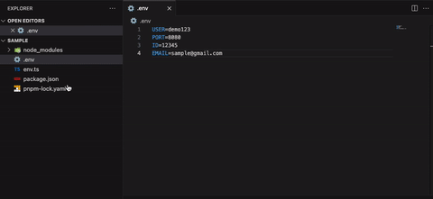

# Env Sample Generator

## Features

Right click a .env in the explorer to quickly generate a sample .env for that file
 

Quickly generate a zod schema for the .env, only supports string or number type
 
